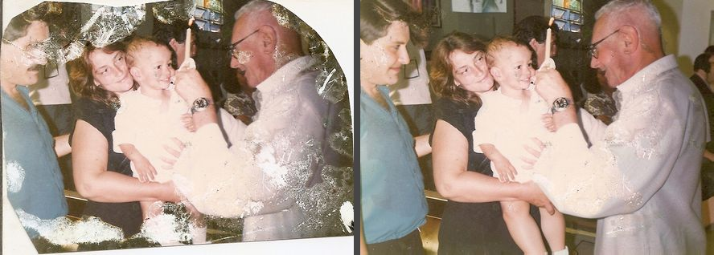
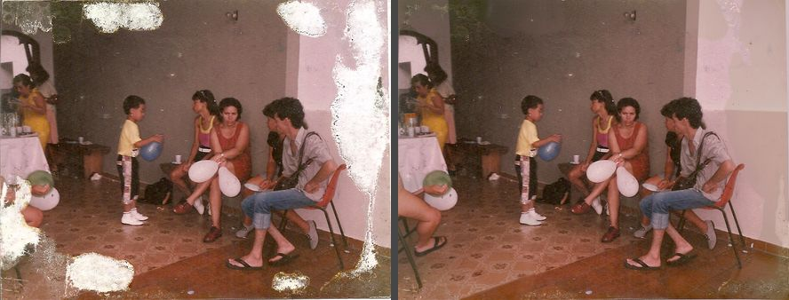
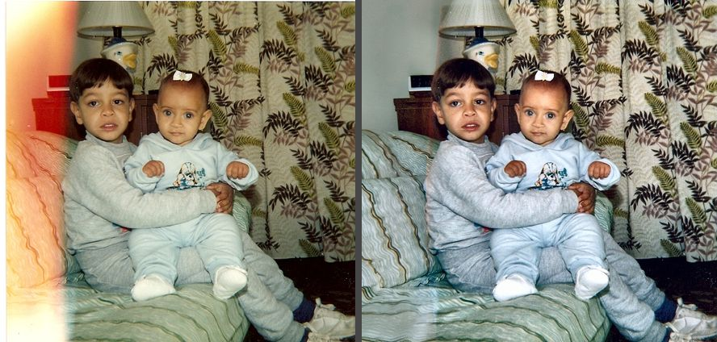

# photo-restore

An agent skill that restores scanned photo prints on a home PC, for free and
offline: give it an image or a folder of scans and water and emulsion
damage, stains, scratches, creases and cut corners are repainted by a local
image-edit model, but **only inside the damaged areas** — every undamaged
pixel, every face, is the scan's own. Faded or colour-cast prints get an
automatic colour fix, and broken JPEG files are re-saved.

> Tailored to this machine (an NVIDIA GPU with 6 GB, ComfyUI with FLUX.2
> klein 4B and Qwen-Image-Edit-2511). Treat it as an example and adapt.

## How a print is restored

1. The whole scan goes to the model with a "repair this damaged print"
   instruction (FLUX.2 klein, ~30 s at 1 MP; Qwen-Image-Edit as the
   alternative, ~100 s).
2. The output is aligned to the original (ECC affine) and its colours
   matched to the original (per-channel linear fit on the pixels the model
   left alone).
3. Where the two still differ strongly, the model repaired something: that
   is the damage mask. Regions are numbered on `work/<name>.regions.jpg` so
   the agent (and you) can see exactly what will change, and drop, include
   or add regions and re-run without a new model call.
4. The model's pixels replace the original only inside the mask, feathered.
   The photo keeps its original colours (the pasted pixels were matched to
   them). `--fix-color`, or `--mode color` for faded prints, adds
   auto-levels + a half grey-world balance + light CLAHE (no AI). Results
   are JPEG q95 with the original's EXIF.

The agent looks at every `work/<name>.compare.jpg` (original | result)
before a photo counts as done.

## Examples

Scans of family prints from the 1980s–90s, restored by the skill with the
default settings (FLUX.2 klein, threshold 22). Left: the scan. Right: the
result. In every case the faces and everything outside the red mask are
the scan's own pixels.

**Water damage and cut corners** — the emulsion lifted off in white
blotches and the print had two corners cut. The blotches are repainted,
the corners extended; the faces were never inside the mask.



**Emulsion loss along the edges** — a party print with the image layer
gone around the borders. Only the borders change.



**A print cut into a heart** — the pink scanner background outside the
print is treated as missing picture and extended. Everything beyond the
heart is invented by the model, which is what the agent must say when it
reports such a photo.


**Light leak and fading** — the orange band on the left is a light leak,
repainted by the model; the colour fix (`--fix-color`) then removes the
yellow cast. Light leaks are only repaired when they are strong enough to
read as damage; a pale wash over a scene is left alone.



## Skills

| Skill | Scripts | What it does |
| --- | --- | --- |
| [`restore-photos`](restore-photos/) | `restore.py`, `crop.py`, `faces.py`, `compare_server.py`, `inpaint.py`, `fix_color.py`, `fix_broken.py`, `contact_sheet.py`, `comfy_client.py`, `examples/` | `/restore-photos <image-or-folder>`: repairs scanned prints — water and emulsion damage, stains, scratches, creases, cut corners — with a local image-edit model (FLUX.2 klein by default, Qwen-Image-Edit with `--backend qwen`, both in ComfyUI, free, offline) and takes the model's pixels **only inside the damage mask**: the output is aligned and colour-matched to the scan, the areas where it still differs are the damage it repaired, and every other pixel, every face, stays the scan's own, in the scan's own colours. `--fix-color` adds an automatic colour fix after the repair; `--mode color` runs that fix alone on faded or colour-cast prints (no model, ~1 s/photo). A folder (`--recursive` for sub-folders) ends with QC contact sheets; the agent reviews every one and fixes a mask for free with `--reuse-raw` plus `--drop N` / `--include N` / `--add x,y,w,h` / `--protect x,y,w,h`, or rerolls with `--seed`. Scans are straightened and their white borders cut first (`--cut` for destroyed edges, `--no-crop` to keep them), faces keep the scan's features (`--ref` gives the model a clean photo of the same people instead, `--whole` takes its picture as the result). `fix_broken.py` re-saves JPEGs with a data-stream error or a truncated tail (`--crop-strip` removes the grey strip), EXIF kept. `compare_server.py` is the review page: original and result side by side, a pick and a note per photo, saved next to the results. Results in `~/Downloads/photo-restore/<folder name>/`, sources never touched. |

The `SKILL.md` documents the flags and a table of "what the user says →
which flags to pass".

## Layout

```
restore-photos/SKILL.md      what the agent reads: which script, which flags, the QC loop
restore-photos/scripts/
    restore.py               image(s) or folder -> model pass -> damage mask -> composite, original colours; QC sheets per folder
                             (--fix-color adds the colour fix; --mode color: colour only; --recursive)
    inpaint.py               native-resolution repaint of masked regions on big scans (--hires)
    crop.py                  straighten a crooked scan, cut its white borders
    faces.py                 find faces (OpenCV Haar, no download) and keep them the scan's
    higgsfield_restore.py    optional online restore with Higgsfield (paid), shown as a third option on the review page
    compare_server.py        review page: original | restored, a pick + note per photo -> preferences.json
    compare.html             its page
    fix_color.py             the colour fix alone (auto levels, grey world, CLAHE, saturation)
    fix_broken.py            re-save JPEGs with stream errors / truncated tails, EXIF kept
    contact_sheet.py         before/after sheets for batch QC
    comfy_client.py          ComfyUI HTTP client, klein + qwen workflows, --check
setup.sh                     venv + config template
```

Results go to `~/Downloads/photo-restore/<folder name>/` for a folder and
`~/Downloads/photo-restore/` for loose images (`PHOTO_RESTORE_OUT` or
`--output` change the root): `restored/` (JPEG q95, original EXIF),
`work/` (model output, mask, numbered regions, original | result) and
`sheets/` (QC contact sheets). Sources are never modified.

## Setup

```bash
./setup.sh
```

creates `venv/` (OpenCV, numpy, Pillow) and an empty
`~/.config/photo-restore/comfyui.env`:

```
COMFYUI_URL=        # default http://127.0.0.1:8188
COMFYUI_SERVICE=    # systemd --user unit the scripts may start, e.g. comfyui
```

`exiftool` (package `libimage-exiftool-perl`) is optional but recommended:
without it the restored files lose their date and camera tags.

### Local AI models

Not installed by this repo. The reproducible install lives in
[gimp-setup](https://github.com/diegochagas/gimp-setup) (`features/comfyui.sh`):
ComfyUI with the ComfyUI-GGUF node, the model files, and a `comfyui`
**systemd user service** on `127.0.0.1:8188` that is deliberately not
enabled at boot, because a loaded model holds several GB of GPU memory and
up to ~23 GB of RAM (Qwen) while it runs. `--backend klein` (default) needs
`diffusion_models/flux-2-klein-4b-fp8.safetensors`,
`text_encoders/qwen_3_4b.safetensors` and `vae/flux2-vae.safetensors`;
`--backend qwen` needs `unet/qwen-image-edit-2511-Q4_K_M.gguf`,
`text_encoders/qwen_2.5_vl_7b_fp8_scaled.safetensors`,
`vae/qwen_image_vae.safetensors` and
`loras/Qwen-Image-Edit-2511-Lightning-4steps-V1.0-bf16.safetensors`.

ComfyUI has to be **running while the scripts run**. With `COMFYUI_SERVICE`
set in `~/.config/photo-restore/comfyui.env` the scripts start it on demand,
but they never stop it, so stop it yourself when you are done:

```bash
systemctl --user start comfyui     # then open http://127.0.0.1:8188
systemctl --user stop comfyui      # frees the GPU and the RAM
systemctl --user status comfyui    # is it running?
```

`venv/bin/python restore-photos/scripts/comfy_client.py --check` tells
which backend has its model files. To use a ComfyUI you already run
elsewhere, set `COMFYUI_URL` and leave `COMFYUI_SERVICE` empty.

## Usage

```bash
# a folder of scans (or one image, or several): repair, original colours kept
venv/bin/python restore-photos/scripts/restore.py "~/Scans/Fotos da vovó"
#   -> ~/Downloads/photo-restore/Fotos da vovó/{restored,work,sheets}/

# damaged AND faded: repair, then the colour fix
venv/bin/python restore-photos/scripts/restore.py "~/Scans/Fotos da vovó" --fix-color

# faded only: colour fix, no model
venv/bin/python restore-photos/scripts/restore.py "~/Scans/Fotos da vovó" --mode color

# fix one mask without a new model call: region 4 was a real hand, region 9 is damage under the threshold
venv/bin/python restore-photos/scripts/restore.py "~/Scans/Fotos da vovó/x.jpg" --reuse-raw --drop 4 --include 9

# review the results in the browser (paths in ~/.config/photo-restore/compare.env,
# or on the command line): pick original / restored / redo and leave a note per photo
venv/bin/python restore-photos/scripts/compare_server.py --results "<output folder>" --originals "<scans folder>"

# JPEGs with a data-stream error or a truncated tail
venv/bin/python restore-photos/scripts/fix_broken.py ~/Scans/broken/*.jpg --crop-strip
```

## License

MIT
